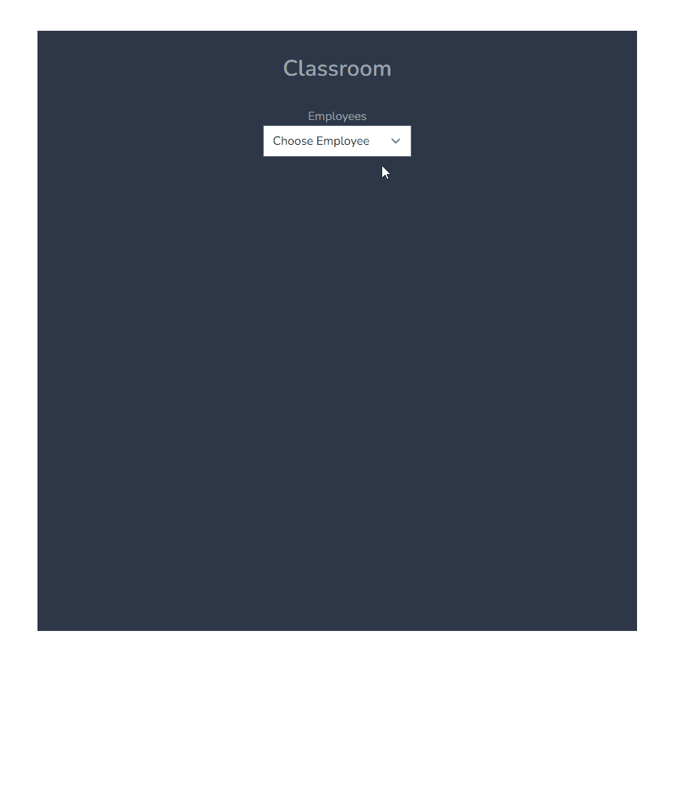

<h1> Setup </h1>

Requires Docker & PHP 8.

1: Clone the repo to a suitable location  
2: Ensure composer is installed in the root directory ("composer install")  
3: Install the node modules ("npm install")  
4: Run migrations for database setup ("php artisan migrate")  
5: Run the webpack mix ("npm run dev" & "npm run prod" - You can continously watch css and js files with "npm run watch")  
6: Create a .env file and copy the variables from the example. You will need to fill in the API_TOKEN with your own API Token and the SCHOOL_ID with the test school's ID  
7: Generate an APP_KEY ("php artisan key:generate")  
8: Open the browser and go to localhost. The page should load.

<h1> Features </h1>
The aim of this project is to help Teachers see which students are in their class on each day of the week.  
The list of students can be found by clicking on the "classroom" link or by going to "/classroom".  
Multiple dropdowns will be on display, one for employee names, and one for classrooms. Once the two dropdowns have had an option selected, the table will be filled with student names that belong to the selected employee & classroom.    

<h1> Classroom Page: </h1>  

